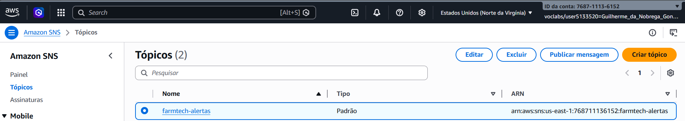
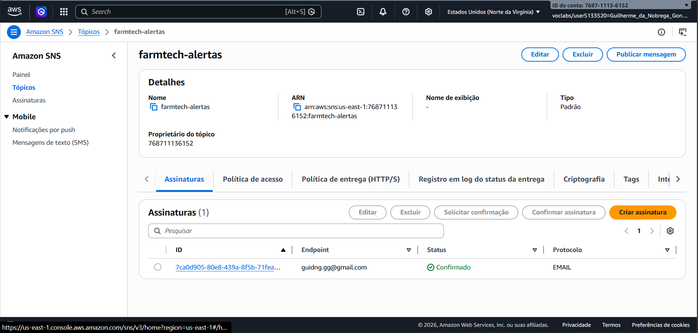
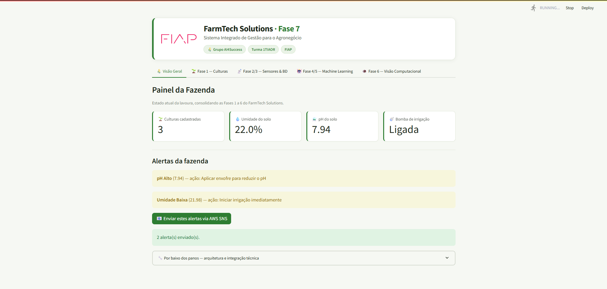
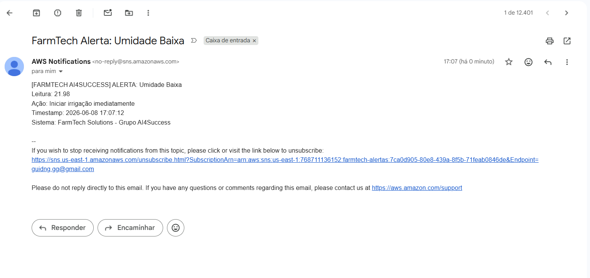
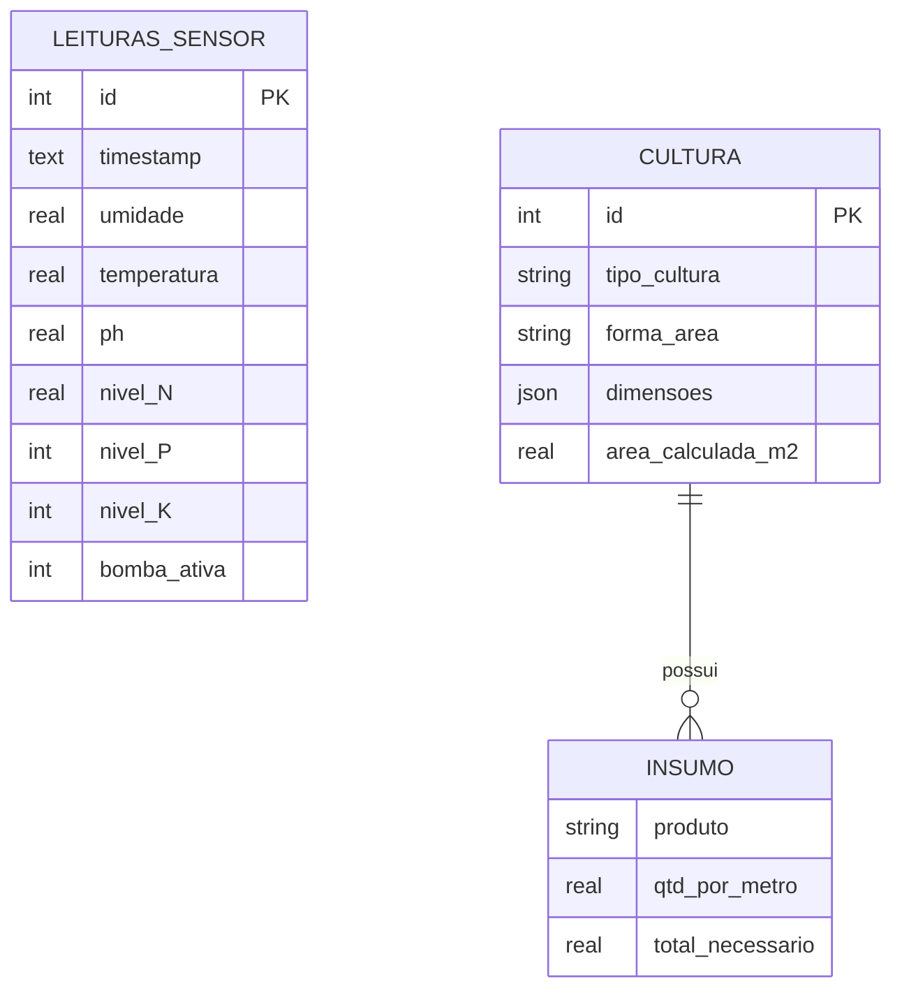

# FIAP - Faculdade de Informática e Administração Paulista

<p align="center">
<a href= "https://www.fiap.com.br/"></a>
</p>

<br>

# FarmTech Solutions — Sistema Integrado Fase 7

## Grupo AI4Success - Turma 1TIAOR

## 👨‍🎓 Integrantes: 
- Durval de Oliveira Dorta Junior - RM567007
- Murilo Ferreira Borges - RM567738
- Guilherme Cury - RM564011
- Guilherme da Nobrega Gontijo - RM562211
- Estevao Ferreira Santos - RM567522

## 👩‍🏫 Professores:
### Tutor(a) 
- Ana Cristina dos Santos
### Coordenador(a)
- <a href="https://www.linkedin.com/in/andregodoi/">Andre Godoi Chiovato</a>


## 📜 Descrição

O projeto FarmTech Solutions — Fase 7 consolida em uma única dashboard Streamlit todas as entregas realizadas nas Fases 1 a 6 do PBL de Inteligência Artificial. O sistema integra o CRUD de culturas agrícolas (Fase 1), a simulação de sensores IoT ESP32 com DHT22, LDR e NPK (Fase 2), o banco de dados relacional com queries SQL (Fase 3), o modelo de Machine Learning Random Forest para predição de produtividade com R²=0.9703 (Fase 4), o serviço de alertas AWS SNS por e-mail (Fase 5) e a análise de saúde das plantações por visão computacional com YOLOv8-cls (Fase 6).

O serviço de mensageria AWS SNS dispara alertas automáticos com ações corretivas sempre que leituras de sensor ultrapassam os thresholds configurados ou quando a análise visual da Fase 6 detecta pragas ou deficiências nutricionais, notificando os funcionários da fazenda diretamente por e-mail.


## 🔗 Links Rápidos
- **Repositório GitHub:** [Acessar Repositório](https://github.com/Guibeast/fase7-farmtech)
- **Vídeo Demonstrativo:** [Assistir no YouTube](INSERIR_LINK_YOUTUBE)


## 📁 Estrutura de pastas

Dentre os arquivos e pastas presentes na raiz do projeto, definem-se:

- <b>.streamlit</b>: Contém o arquivo `secrets.toml` com as credenciais AWS para o serviço de alertas SNS (não versionado).

- <b>assets</b>: Contém arquivos relacionados a elementos não-estruturados, como a logomarca da FIAP utilizada neste README.

- <b>data</b>: Armazena os dados do sistema — `dados_agricolas.csv` (dataset do modelo ML da Fase 4), `clima_cidades.csv` (snapshot meteorológico das cidades para a análise R) e a pasta `fase6_amostras/` com imagens de teste para a visão computacional. Os arquivos `farmtech_dados.json` (culturas da Fase 1) e `farmtech.db` (banco SQLite da Fase 3) são gerados automaticamente em tempo de execução.

- <b>docs</b>: Contém o arquivo `requirements.txt` com as dependências do projeto, conforme o padrão adotado nas entregas anteriores.

- <b>models</b>: Armazena o modelo Random Forest treinado (`regressor_model.pkl`) e os scripts `gerar_dados.py` e `train_model.py` para reprodução do treinamento.

- <b>src</b>: Módulos Python de cada fase — `fase1_culturas.py`, `fase1_clima.py` (integração com a API meteorológica Open-Meteo), `fase2_iot.py`, `fase3_banco.py`, `fase6_visao.py` e `aws_alertas.py`.

- <b>esp32</b>: Sketch `bomba_npk.ino` (Arduino/C++) da estação ESP32 das Fases 2/3 — leitura de DHT22, LDR e NPK com acionamento automático da bomba de irrigação, saída para o **Serial Plotter** e exibição das métricas críticas em **display LCD 16x2 I2C** (Fase 4).

- <b>analise_r</b>: Análises estatísticas da Fase 1 em R — `analise_culturas.R` (dataset agrícola) e `analise_clima.R` (dados meteorológicos da API). Geram gráficos e estatísticas em `analise_r/saidas/`.

- <b>dashboard.py</b>: Ponto de entrada da interface gráfica. Execute com `streamlit run dashboard.py`.

- <b>main.py</b>: Ponto de entrada por terminal. Dispara cada serviço das Fases 1 a 6 por linha de comando (menu interativo ou `python main.py <serviço>`).

- <b>README.md</b>: Arquivo que serve como guia e explicação geral sobre o projeto (o mesmo que você está lendo agora).


## 🔧 Como executar o código

1.  **Pré-requisitos**:
    * Python 3.11 ou superior.
    * pip.

2.  **Instalação**:
    Clone o repositório e instale as dependências:
    ```bash
    pip install -r requirements.txt
    ```

3.  **Execução (interface gráfica)**:
    ```bash
    streamlit run dashboard.py
    ```
    Acesse em: `http://localhost:8501`

4.  **Execução (por terminal)**:
    Conforme o enunciado, cada serviço também pode ser disparado por linha de comando, sem a interface gráfica:
    ```bash
    python main.py            # menu interativo
    python main.py sensor     # leitura da estação ESP32 (Fase 2)
    python main.py banco      # grava e consulta o banco SQLite (Fase 3)
    python main.py ml         # predição de produtividade (Fase 4/5)
    python main.py clima      # previsão Open-Meteo e recomendação de irrigação (Fase 1)
    python main.py visao      # classificação de doença na folha de café (Fase 6)
    python main.py alerta     # envia alerta de teste via AWS SNS (Fase 5)
    ```
    Serviços disponíveis: `culturas`, `sensor`, `banco`, `ml`, `clima`, `visao`, `alerta`, `dashboard`.

5.  **Configuração AWS SNS (opcional)**:
    Crie o arquivo `.streamlit/secrets.toml` com as credenciais do AWS Learner Lab:
    ```toml
    AWS_ACCESS_KEY_ID = "sua_chave"
    AWS_SECRET_ACCESS_KEY = "sua_chave_secreta"
    AWS_SESSION_TOKEN = "seu_token"
    AWS_REGION = "us-east-1"
    SNS_TOPIC_ARN = "arn:aws:sns:us-east-1:XXXX:farmtech-alertas"
    ```

## 🖥 Dashboard — Abas e Integração das Fases

O dashboard consolida as Fases 1 a 6 em cinco abas:

| Aba | Fase(s) | Conteúdo |
|-----|---------|----------|
| 🌾 Visão Geral | 1–6 | Cards de status da fazenda, alertas ativos e disparo dos alertas via AWS SNS |
| 🌱 Fase 1 — Culturas | 1 | CRUD de culturas (soja/café), cálculo de área e insumos, clima Open-Meteo e análise R |
| 📡 Fase 2/3 — Sensores & BD | 2 e 3 | Leitura da estação ESP32 simulada, histórico e persistência no banco SQLite com queries SQL |
| 🤖 Fase 4/5 — Machine Learning | 4 e 5 | Predição de produtividade (Random Forest), correlações e análise de custos AWS |
| 👁️ Fase 6 — Visão Computacional | 6 | Classificação de doenças/pragas na folha de café com YOLOv8-cls + métricas de treino |

O serviço de alertas AWS SNS (Fase 5) é acionável a partir da aba Visão Geral (alertas de sensor) e da aba Fase 6 (alerta visual), integrando as leituras das Fases 1/3 e a visão computacional da Fase 6.


## 📊 AWS SNS — Serviço de Alertas

### Arquitetura da solução

Aproveitando a infraestrutura AWS da Fase 5, implementamos um serviço de mensageria com o **Amazon SNS** (Simple Notification Service) integrado à dashboard:

```
Sensores (Fase 1/3)  ┐
Visão computacional  ├─► dashboard.py ─► src/aws_alertas.py (boto3) ─► Amazon SNS ─► E-mail dos funcionários
(Fase 6)             ┘        (avalia thresholds e monta a ação corretiva)         (Topic: farmtech-alertas)
```

O módulo `src/aws_alertas.py` autentica via credenciais do Learner Lab (lidas de `.streamlit/secrets.toml`, fora do versionamento) e publica no tópico SNS. A mensagem inclui o tipo de alerta, a leitura que o disparou e a **ação corretiva** sugerida ao funcionário. O disparo acontece a partir da aba **Visão Geral** (alertas de sensor das Fases 1/3) e da aba **Fase 6** (alerta da análise visual).

### Alertas e ações corretivas (definidas pelo grupo)

| Origem | Condição | Ação corretiva enviada |
|--------|----------|------------------------|
| Sensor (Fase 1/3) | Umidade do solo < 30% | Iniciar irrigação imediatamente |
| Sensor (Fase 1/3) | Temperatura > 38°C | Aumentar frequência de irrigação |
| Sensor (Fase 1/3) | pH fora de 5,5–7,5 | Corrigir acidez/alcalinidade do solo |
| Sensor (Fase 1/3) | Nitrogênio (N) baixo | Aplicar fertilizante nitrogenado |
| Visão (Fase 6) | Praga ou doença detectada | Isolar área e consultar agrônomo |

### Passos realizados no console AWS

1. SNS → **Create Topic** → Standard → nome `farmtech-alertas`
2. **Create Subscription** → Protocol: Email → Endpoint: e-mail do grupo
3. Confirmação da subscription pelo link recebido no e-mail
4. Topic ARN copiado para `.streamlit/secrets.toml` (chave `SNS_TOPIC_ARN`)

### Prints da solução

**1. Tópico `farmtech-alertas` criado no Amazon SNS** (console AWS, com o ARN usado pela aplicação):



**2. Assinatura de e-mail com status `Confirmado`** — canal de entrega ativo, pronto para receber as notificações:



**3. Disparo pelo sistema** — botão *"Enviar estes alertas via AWS SNS"* na dashboard publicando os alertas de sensor (umidade baixa e pH alto) no tópico:



**4. E-mail recebido pelo funcionário** — notificação entregue pelo SNS com a leitura que disparou o alerta e a **ação corretiva** sugerida:




## 🌦 API Meteorológica (Open-Meteo)

A aba **Fase 1 — Culturas** integra a API pública [Open-Meteo](https://open-meteo.com/) (gratuita, sem chave de API). O sistema busca a previsão de temperatura e chuva para o polo agrícola selecionado e cruza com a umidade do solo lida pelos sensores (Fase 2) para recomendar a irrigação:

- Chuva relevante prevista nas próximas 48h → **adiar irrigação** (economia de água).
- Solo seco e sem chuva → **iniciar irrigação**.
- Caso contrário → **manter manejo atual**.

Implementação em `src/fase1_clima.py`.


## 📊 Análise Estatística em R

A Fase 1 inclui **duas** análises estatísticas escritas em **R** (base R, sem pacotes externos):

1. **Dataset agrícola** (`analise_r/analise_culturas.R`) — resumo descritivo, média/mediana/desvio, matriz de correlação, histograma da produtividade, boxplots e dispersão umidade × produtividade sobre `data/dados_agricolas.csv`.
2. **Meteorologia** (`analise_r/analise_clima.R`) — análise estatística **sobre os dados meteorológicos reais** da API Open-Meteo (`data/clima_cidades.csv`, snapshot das 18 cidades agrícolas): correlação entre temperatura, umidade, evapotranspiração (ET0), UV e vento, com gráficos de ET0 por cidade e temperatura × ET0.

**Como executar:**
```bash
Rscript analise_r/analise_culturas.R
Rscript analise_r/analise_clima.R
```
As saídas são gravadas em `analise_r/saidas/` e exibidas no dashboard (aba Fase 1, expander "Análise Estatística em R").


## 🗃 Modelo de Dados (MER/DER)

Modelo relacional da Fase 2/3. A tabela `LEITURAS_SENSOR` (SQLite, equivalente ao Oracle) persiste as leituras da estação ESP32; a entidade `CULTURA` (Fase 1, persistida em JSON) registra o plantio e seus insumos.




## 🗃 Histórico de lançamentos

* 1.1.0 - 08/06/2026
    * Prints reais da solução de mensageria AWS SNS adicionados ao README e ajustes finais de documentação.
* 1.0.0 - 04/06/2026
    * Subida do sistema integrado da Fase 7: dashboard Streamlit consolidando as Fases 1 a 6, execução por terminal (`main.py`), serviço de alertas AWS SNS, análises em R e conformidade com o enunciado.


## 📋 Licença

<p xmlns:cc="http://creativecommons.org/ns#" xmlns:dct="http://purl.org/dc/terms/"><a property="dct:title" rel="cc:attributionURL" href="https://github.com/agodoi/template">MODELO GIT FIAP</a> por <a rel="cc:attributionURL dct:creator" property="cc:attributionName" href="https://fiap.com.br">Fiap</a> está licenciado sobre <a href="http://creativecommons.org/licenses/by/4.0/?ref=chooser-v1" target="_blank" rel="license noopener noreferrer" style="display:inline-block;">Attribution 4.0 International</a>.</p>
