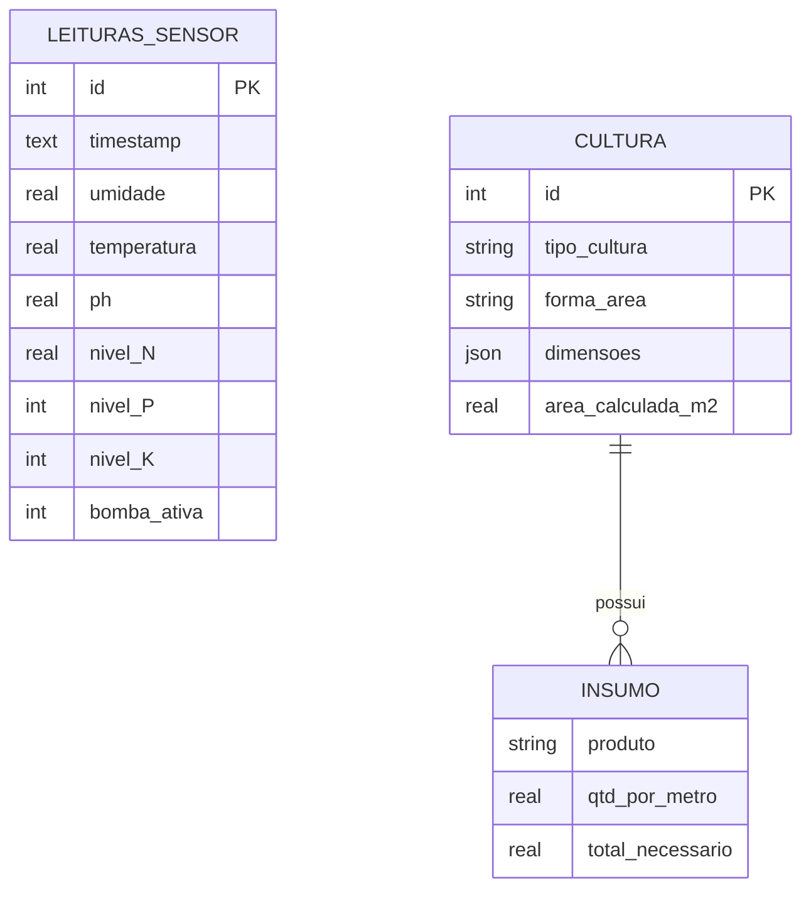

# FIAP - Faculdade de Informática e Administração Paulista

<p align="center">
<a href= "https://www.fiap.com.br/"></a>
</p>

<br>

# FarmTech Solutions — Sistema Integrado Fase 7

## Grupo AI4Success - Turma 1TIAOR

## 👨‍🎓 Integrantes: 
- <a href="https://www.linkedin.com/in/durval-dorta-junior-585311202/">Durval de Oliveira Dorta Junior - RM567007</a>
- <a href="https://www.linkedin.com/">Murilo Ferreira Borges - RM567738</a>
- <a href="https://www.linkedin.com/">Guilherme Cury - RM564011</a> 
- <a href="https://www.linkedin.com/">Guilherme da Nobrega Gontijo - RM562211</a> 
- <a href="https://www.linkedin.com/">Estevao Ferreira Santos - RM567522</a>

## 👩‍🏫 Professores:
### Tutor(a) 
- <a href="https://www.linkedin.com/">Ana Cristina dos Santos</a>
### Coordenador(a)
- <a href="https://www.linkedin.com/in/andregodoi/">Andre Godoi Chiovato</a>


## 📜 Descrição

O projeto FarmTech Solutions — Fase 7 consolida em uma única dashboard Streamlit todas as entregas realizadas nas Fases 1 a 6 do PBL de Inteligência Artificial. O sistema integra o CRUD de culturas agrícolas (Fase 1), a simulação de sensores IoT ESP32 com DHT22, LDR e NPK (Fase 2), o banco de dados relacional com queries SQL (Fase 3), o modelo de Machine Learning Random Forest para predição de produtividade com R²=0.9703 (Fase 4), o serviço de alertas AWS SNS por e-mail e SMS (Fase 5) e a análise de saúde das plantações por visão computacional com OpenCV e YOLO (Fase 6).

O serviço de mensageria AWS SNS dispara alertas automáticos com ações corretivas sempre que leituras de sensor ultrapassam os thresholds configurados ou quando a análise visual da Fase 6 detecta pragas ou deficiências nutricionais, notificando os funcionários da fazenda diretamente por e-mail.


## 🔗 Links Rápidos
- **Repositório GitHub:** [Acessar Repositório](https://github.com/Guibeast/farmtech-fase7)
- **Vídeo Demonstrativo:** [Assistir no YouTube](INSERIR_LINK_YOUTUBE)


## 📁 Estrutura de pastas

Dentre os arquivos e pastas presentes na raiz do projeto, definem-se:

- <b>.streamlit</b>: Contém o arquivo `secrets.toml` com as credenciais AWS para o serviço de alertas SNS (não versionado).

- <b>assets</b>: Contém arquivos relacionados a elementos não-estruturados, como a logomarca da FIAP utilizada neste README.

- <b>data</b>: Armazena os dados persistentes do sistema — `dados_agricolas.csv` (dataset do modelo ML da Fase 4), `farmtech_dados.json` (culturas cadastradas na Fase 1), `farmtech.db` (banco SQLite da Fase 3) e a pasta `fase6_amostras/` com imagens de teste para a visão computacional.

- <b>docs</b>: Contém o arquivo `requirements.txt` com as dependências do projeto, conforme o padrão adotado nas entregas anteriores.

- <b>models</b>: Armazena o modelo Random Forest treinado (`regressor_model.pkl`) e os scripts `gerar_dados.py` e `train_model.py` para reprodução do treinamento.

- <b>src</b>: Módulos Python de cada fase — `fase1_culturas.py`, `fase1_clima.py` (integração com a API meteorológica Open-Meteo), `fase2_iot.py`, `fase3_banco.py`, `fase6_visao.py` e `aws_alertas.py`.

- <b>esp32</b>: Sketch `bomba_npk.ino` (Arduino/C++) da estação ESP32 da Fase 2 — leitura de DHT22, LDR e NPK com acionamento automático da bomba de irrigação.

- <b>analise_r</b>: Script `analise_culturas.R` com a análise estatística da Fase 1 sobre o dataset agrícola (gera gráficos e estatísticas em `analise_r/saidas/`).

- <b>dashboard.py</b>: Ponto de entrada da aplicação. Execute com `streamlit run dashboard.py`.

- <b>README.md</b>: Arquivo que serve como guia e explicação geral sobre o projeto (o mesmo que você está lendo agora).


## 🔧 Como executar o código

1.  **Pré-requisitos**:
    * Python 3.11 ou superior.
    * pip.

2.  **Instalação**:
    Clone o repositório e instale as dependências:
    ```bash
    pip install -r requirements.txt
    ```

3.  **Execução**:
    ```bash
    streamlit run dashboard.py
    ```
    Acesse em: `http://localhost:8501`

4.  **Configuração AWS SNS (opcional)**:
    Crie o arquivo `.streamlit/secrets.toml` com as credenciais do AWS Learner Lab:
    ```toml
    AWS_ACCESS_KEY_ID = "sua_chave"
    AWS_SECRET_ACCESS_KEY = "sua_chave_secreta"
    AWS_SESSION_TOKEN = "seu_token"
    AWS_REGION = "us-east-1"
    SNS_TOPIC_ARN = "arn:aws:sns:us-east-1:XXXX:farmtech-alertas"
    ```

## 📊 AWS SNS — Serviço de Alertas

O serviço de mensageria foi configurado no AWS Learner Lab utilizando o Amazon SNS (Simple Notification Service). Alertas são disparados automaticamente pela dashboard quando:

- Umidade do solo abaixo de 30% → ação: iniciar irrigação imediatamente
- Temperatura acima de 38°C → ação: aumentar frequência de irrigação
- pH fora da faixa 5,5–7,5 → ação: corrigir acidez/alcalinidade do solo
- Visão computacional detecta praga ou doença → ação: isolar área e consultar agrônomo

**Passos realizados no console AWS:**
1. SNS → Create Topic → Standard → nome: `farmtech-alertas`
2. Create Subscription → Protocol: Email → Endpoint: e-mail do grupo
3. Confirmação da subscription no e-mail recebido
4. Topic ARN copiado para `.streamlit/secrets.toml`

> Adicione aqui os prints do console AWS (tópico SNS, subscription confirmada e e-mail de alerta recebido).


## 🌦 API Meteorológica (Open-Meteo)

A aba **Fase 1 — Culturas** integra a API pública [Open-Meteo](https://open-meteo.com/) (gratuita, sem chave de API). O sistema busca a previsão de temperatura e chuva para o polo agrícola selecionado e cruza com a umidade do solo lida pelos sensores (Fase 2) para recomendar a irrigação:

- Chuva relevante prevista nas próximas 48h → **adiar irrigação** (economia de água).
- Solo seco e sem chuva → **iniciar irrigação**.
- Caso contrário → **manter manejo atual**.

Implementação em `src/fase1_clima.py`.


## 📊 Análise Estatística em R

A Fase 1 inclui uma análise estatística descritiva do dataset agrícola escrita em **R** (`analise_r/analise_culturas.R`, base R, sem pacotes externos). Gera resumo descritivo, média/mediana/desvio, matriz de correlação e três gráficos.

**Como executar:**
```bash
Rscript analise_r/analise_culturas.R
```
As saídas são gravadas em `analise_r/saidas/` e exibidas no dashboard (aba Fase 1, expander "Análise Estatística em R").


## 🗃 Modelo de Dados (MER/DER)

Modelo relacional da Fase 2/3. A tabela `LEITURAS_SENSOR` (SQLite, equivalente ao Oracle) persiste as leituras da estação ESP32; a entidade `CULTURA` (Fase 1, persistida em JSON) registra o plantio e seus insumos.




## 🗃 Histórico de lançamentos

* 1.0.0 - 02/06/2026
    * Entrega da Fase 7: consolidação completa das Fases 1 a 6 em dashboard única com alertas AWS SNS.
* 0.6.0 - 27/04/2026
    * Fase 6: Visão Computacional com YOLO customizado e CNN do zero.
* 0.5.0 - 2025
    * Fase 5: Cloud AWS, análise comparativa de custos e predição de safra (crop yield).
* 0.4.0 - 2025
    * Fase 4: Dashboard Streamlit, modelo Random Forest, banco SQLite.
* 0.3.0 - 2025
    * Fase 3: Oracle SQL Developer, modelo relacional, queries de análise.
* 0.2.0 - 2025
    * Fase 2: ESP32 C++ com DHT22, LDR, botões NPK e relé de irrigação.
* 0.1.0 - 2025
    * Fase 1: Python CRUD de culturas, cálculo de área e insumos, integração API clima.


## 📋 Licença

<p xmlns:cc="http://creativecommons.org/ns#" xmlns:dct="http://purl.org/dc/terms/"><a property="dct:title" rel="cc:attributionURL" href="https://github.com/agodoi/template">MODELO GIT FIAP</a> por <a rel="cc:attributionURL dct:creator" property="cc:attributionName" href="https://fiap.com.br">Fiap</a> está licenciado sobre <a href="http://creativecommons.org/licenses/by/4.0/?ref=chooser-v1" target="_blank" rel="license noopener noreferrer" style="display:inline-block;">Attribution 4.0 International</a>.</p>
